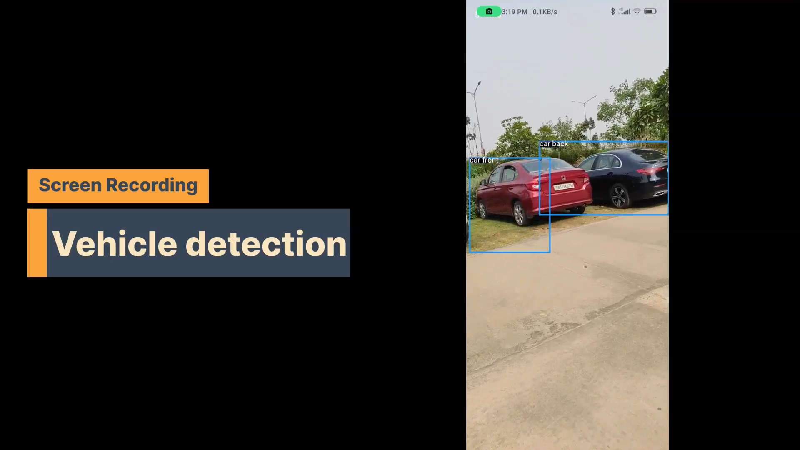
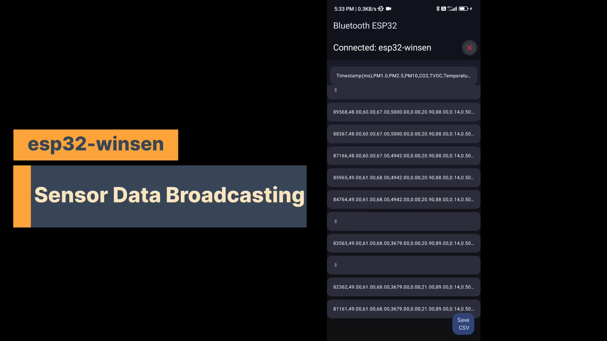

# 🚗 RoadAware – Smart Road Monitoring Android App

**Demo:** [bit.ly/4k15SWe](http://bit.ly/4k15SWe)

## 📱 Overview

**RoadAware** is an Android application built using **Kotlin** that monitors road quality, detects potholes, assesses road congestion, and tracks air quality—all in real-time. It leverages on-device sensors, BLE-based external sensor communication, and computer vision models to provide a holistic view of road conditions. This data can be utilized for **time-series analysis**, enabling research into **driver behavior** and **road safety reactions** under varying environmental and traffic conditions.

---

## 🔧 Features

* ✅ **Pothole Detection**
  Detects potholes based on jerk data from device sensors. Records a 10-second video clip and sends it to the server for **validation** and **heatmap reporting**.
  

* 🧠 **Computer Vision for Traffic Monitoring**
  Real-time congestion and object identification using a vision model.
  

* 📡 **External Sensor Integration via BLE**
  Connects to external BLE-based air quality sensors to collect AQI and environmental data.
  

* 📊 **Live Sensor Dashboard**
  Real-time plots of phone sensor data (accelerometer, gyroscope, etc.) displayed on-device.
  

---

## 🔬 Use Cases

* Traffic & congestion monitoring
* Pothole mapping & municipal reporting
* Air quality impact studies on drivers
* Behavioral analytics under varying road conditions
* Urban mobility research

---

## 🛠️ Tech Stack

* **Android (Kotlin)**
* **BLE (Bluetooth Low Energy)** for external sensor communication
* **CameraX / MLKit / TensorFlow Lite** for vision tasks
* **MPAndroidChart** (or similar) for real-time plotting
* **Room / Retrofit / Firebase** (optional) for data storage & transmission

---

## 📈 Research Potential

The app stores and transmits structured, time-stamped road condition data that can be used for:

* Time-series modeling of road usage patterns
* Statistical analysis of driver responses to hazards
* AI-based prediction models for urban planning

---

## 🚀 Getting Started

1. Clone this repository.
2. Open the project in **Android Studio**.
3. Connect an Android device or emulator with sensor capabilities.
4. Pair your BLE-enabled AQI sensor.
5. Run the app and start capturing road insights!

---

## 📩 Contact

For collaborations or research inquiries:
📧 [abhijeet.shash@gmail.com](mailto:your-abhijeet.shash@gmail.com)

---
